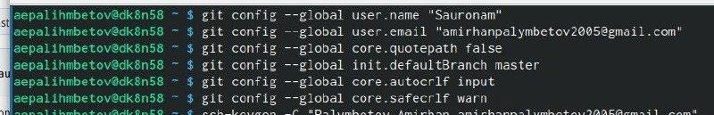
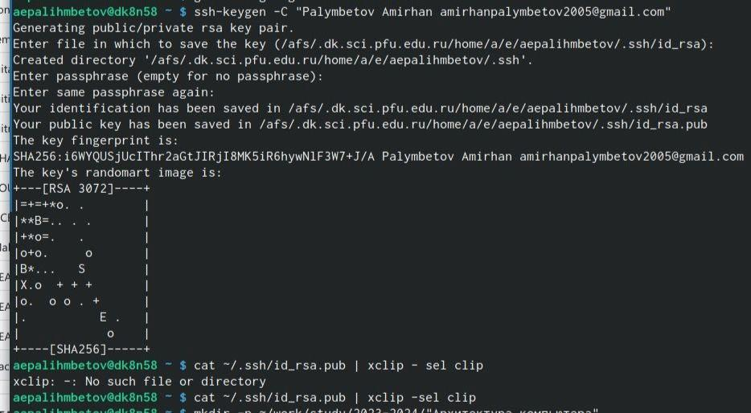
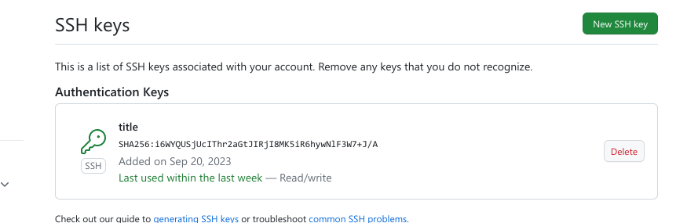
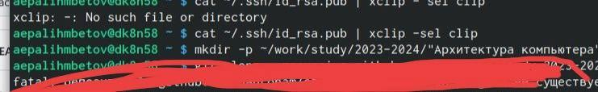
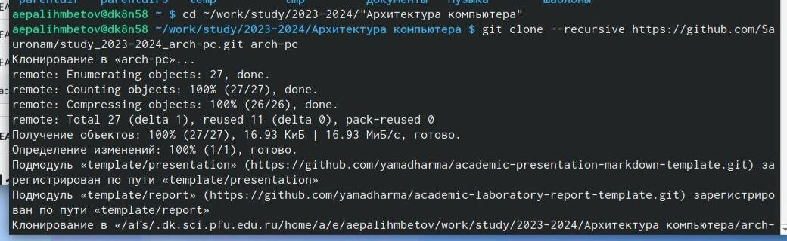
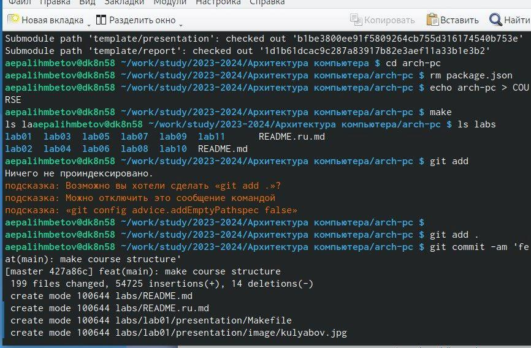
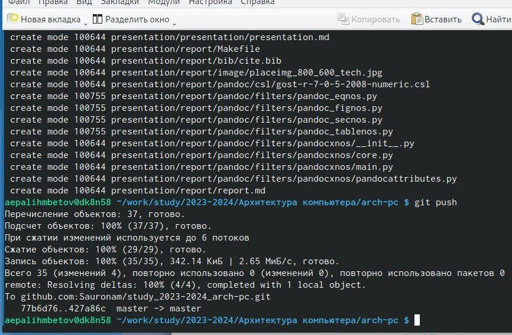
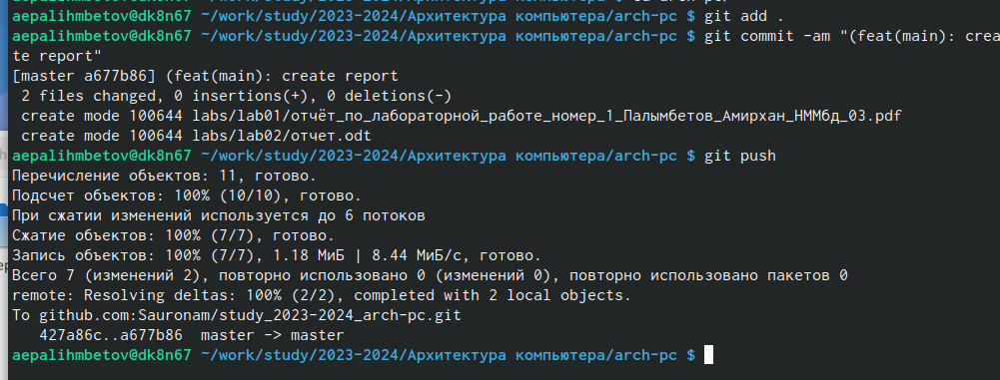

---
## Front matter
title: "Отчёта по лабораторной работе"
subtitle: "№2"
author: "Палымбетов Амирхан Еркинбаевич"

## Generic otions
lang: ru-RU
toc-title:

## Bibliography
bibliography: bib/cite.bib
csl: pandoc/csl/gost-r-7-0-5-2008-numeric.csl

## Pdf output format
toc: true # Table of contents
toc-depth: 2
lof: true # List of figures
lot: true # List of tables
fontsize: 12pt
linestretch: 1.5
papersize: a4
documentclass: scrreprt
## I18n polyglossia
polyglossia-lang:
  name: russian
  options:
	- spelling=modern
	- babelshorthands=true
polyglossia-otherlangs:
  name: english
## I18n babel
babel-lang: russian
babel-otherlangs: english
## Fonts
mainfont: PT Serif
romanfont: PT Serif
sansfont: PT Sans
monofont: PT Mono
mainfontoptions: Ligatures=TeX
romanfontoptions: Ligatures=TeX
sansfontoptions: Ligatures=TeX,Scale=MatchLowercase
monofontoptions: Scale=MatchLowercase,Scale=0.9
## Biblatex
biblatex: true
biblio-style: "gost-numeric"
biblatexoptions:
  - parentracker=true
  - backend=biber
  - hyperref=auto
  - language=auto
  - autolang=other*
  - citestyle=gost-numeric
## Pandoc-crossref LaTeX customization
figureTitle: "Рис."
tableTitle: "Таблица"
listingTitle: "Листинг"
lofTitle: "Список иллюстраций"
lotTitle: "Список таблиц"
lolTitle: "Листинги"
## Misc options
indent: true
header-includes:
  - \usepackage{indentfirst}
  - \usepackage{float} # keep figures where there are in the text
  - \floatplacement{figure}{H} # keep figures where there are in the text
---

# Цель работы

Целью работы является изучить идеологию и применение средств
контроля версий. Приобрести практические навыки по работе с
системой git.

# Задание

Задания:
1. Создать профиль на Github
2. Провести базовые настройки git
3. Создать SHH ключ
4. Создать рабочее пространство и репозиторий курса
5. Настроить каталог курса

# Выполнение лабораторной работы

Задание 1:
Обыкновенная регистрация и создание профиля на github

{#fig:001 width=70%}

Задание 2:
Проводим базовые настройки git
Задаем имя начальной ветки
Настраиваем котировку utf-8
Добавляем два параметра

{#fig:002 width=70%}

Задание 3:
Создаем SHH ключ и добавляем его на сайт github

{#fig:003 width=70%}
{#fig:004 width=70%}

Задание 4:
Создаем рабочее пространство по необходимой нам структуре и
репозиторий по шаблону.

{#fig:005 width=70%}
{#fig:006 width=70%}

Задание 5:
Настраиваем наш каталог создав нужную нам структуру и отправляем
данные о тех изменениях которые мы провели.

{#fig:007 width=70%}
{#fig:008 width=70%}

Выполнение самостоятельной работы:
Переместили предыдущую работу в необходимый нами каталог,
написали отчет и отправили файлы на сервер.

{#fig:009 width=70%}

# Выводы

Мы приобрели практические навыки работы с системой контроля
версий git, изучив его идеологию и применив его на деле.
