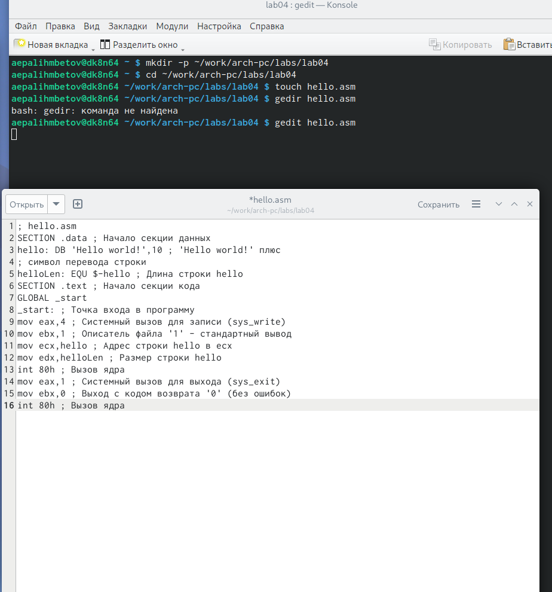
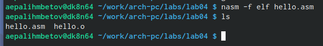
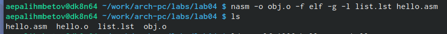
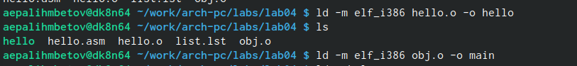
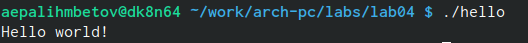
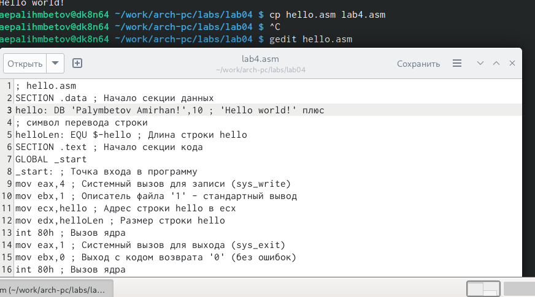
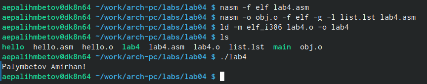
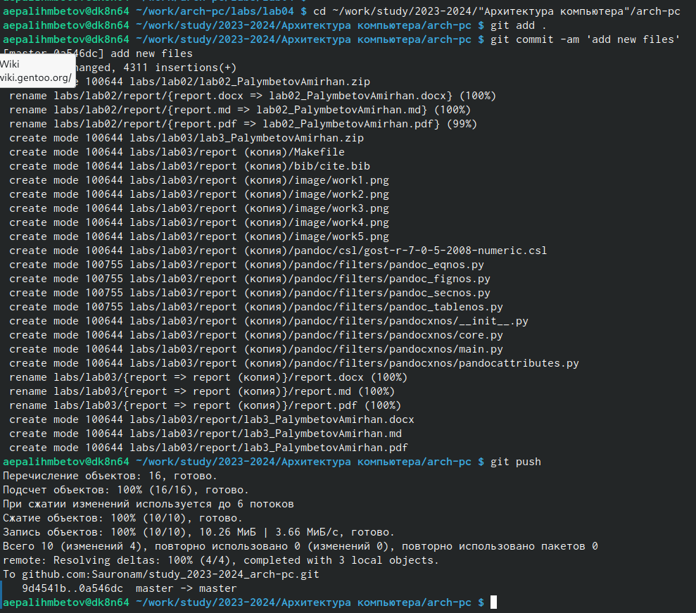

---
## Front matter
title: "Лабораторная работа номер 4"

author: "Палымбетов Амирхан"

## Generic otions
lang: ru-RU
toc-title:

## Bibliography
bibliography: bib/cite.bib
csl: pandoc/csl/gost-r-7-0-5-2008-numeric.csl

## Pdf output format
toc: true # Table of contents
toc-depth: 2
lof: true # List of figures
lot: true # List of tables
fontsize: 12pt
linestretch: 1.5
papersize: a4
documentclass: scrreprt
## Fonts
mainfont: PT Serif
romanfont: PT Serif
sansfont: PT Sans
monofont: PT Mono
mainfontoptions: Ligatures=TeX
romanfontoptions: Ligatures=TeX
sansfontoptions: Ligatures=TeX,Scale=MatchLowercase
monofontoptions: Scale=MatchLowercase,Scale=0.9
## Biblatex
biblatex: true
biblio-style: "gost-numeric"
biblatexoptions:
  - parentracker=true
  - backend=biber
  - hyperref=auto
  - language=auto
  - autolang=other*
  - citestyle=gost-numeric
## Pandoc-crossref LaTeX customization
figureTitle: "Рис."
tableTitle: "Таблица"
listingTitle: "Листинг"
lofTitle: "Список иллюстраций"
lotTitle: "Список таблиц"
lolTitle: "Листинги"
## Misc options
indent: true
header-includes:
  - \usepackage{indentfirst}
  - \usepackage{float} # keep figures where there are in the text
  - \floatplacement{figure}{H} # keep figures where there are in the text
## I18n babel
babel-lang: russian
babel-otherlangs: english
## Fonts
mainfont: PT Serif
romanfont: PT Serif
sansfont: PT Sans
monofont: PT Mono
mainfontoptions: Ligatures=TeX
romanfontoptions: Ligatures=TeX
sansfontoptions: Ligatures=TeX,Scale=MatchLowercase
monofontoptions: Scale=MatchLowercase,Scale=0.9
## Biblatex
biblatex: true
biblio-style: "gost-numeric"
biblatexoptions:
  - parentracker=true
  - backend=biber
  - hyperref=auto
  - language=auto
  - autolang=other*
  - citestyle=gost-numeric
## Pandoc-crossref LaTeX customization
figureTitle: "Рис."
tableTitle: "Таблица"
listingTitle: "Листинг"
lofTitle: "Список иллюстраций"
lotTitle: "Список таблиц"
lolTitle: "Листинги"
## Misc options
indent: true
header-includes:
  - \usepackage{indentfirst}
  - \usepackage{float} # keep figures where there are in the text
  - \floatplacement{figure}{H} # keep figures where there are in the text
---

# Цель работы
Цель данной лабораторной работы - освоить процедуры компиляции и сборки программ, написанных на ассемблере NASM 

# Задание

1.Создание программы Hello world!
2.Работа с транслятором NASM
3.Работы с расширенным синтаксисом командной строки NASM
4.Работа с компоновщиком LD
5.Запуск исполняемого файла
6.Выполнение самостоятельной работы

# Выполнение лабораторной работы

1.Создание программы Hello world!:
Создаем наш рабочий каталог, а также файл с написанным кодом на ассемблере.

{#fig:001 width=70%}

2.Работа с транслятором NASM:
При помощи комады превращаем текст файла в объектный код
файл будет иметь название hello.o

{#fig:002 width=70%}

3.Работы с расширенным синтаксисом командной строки NASM

С помощью команды компилирую файл .asm в .o 

{#fig:003 width=70%}

4.Работа с компоновщиком LD:
При помощи компоновщика получаем исполняемый файл а затем задаем ему имя.

{#fig:004 width=70%}

!5.Запуск исполняемого файл
Тут ничего сложного
просто запускаем файл при помощи команды

{#fig:005 width=70%}

6.Выполнение самостоятельной работы:
Копируем файл и слегка изменяем содержание кода 
далее выполняем все тоже самое что и с предыдущем кодом
затем отправляем все изменения на github

{#fig:006 width=70%}

{width=70%}

{ width=70%}

# Выводы

При выполнении данной лабораторной работы я освоил процедуры компиляции и сборки программ, написанных на ассемблере NASM.

